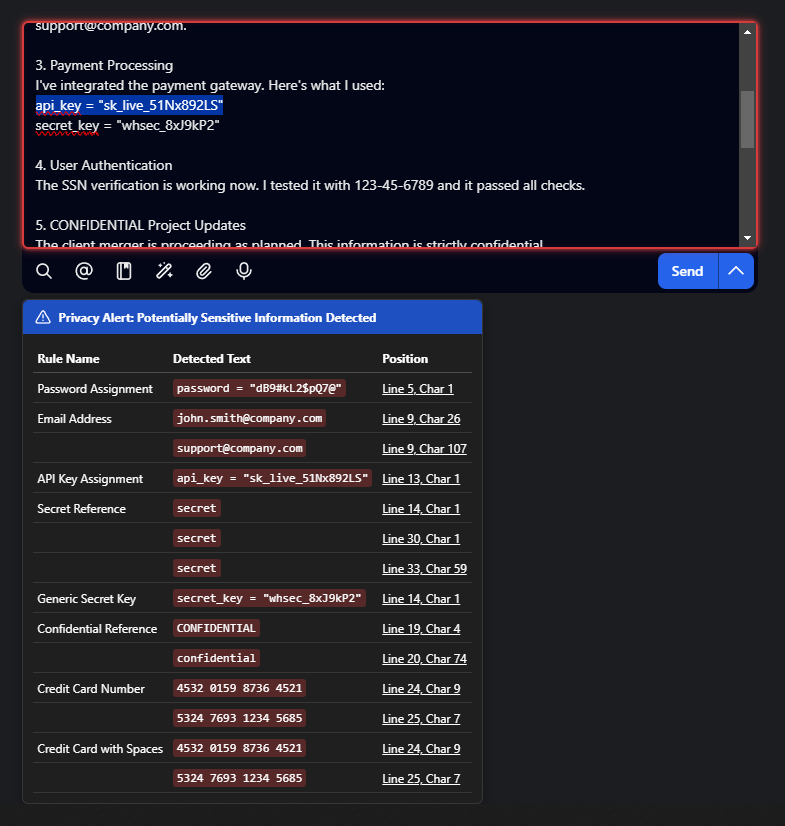
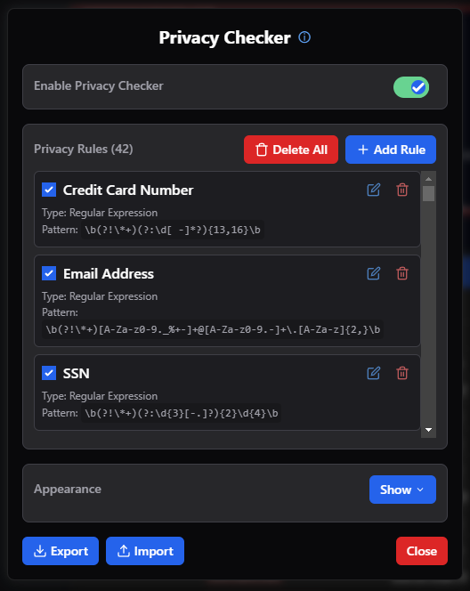
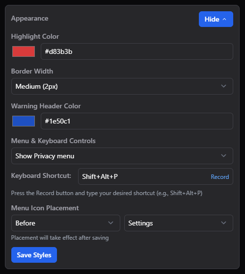
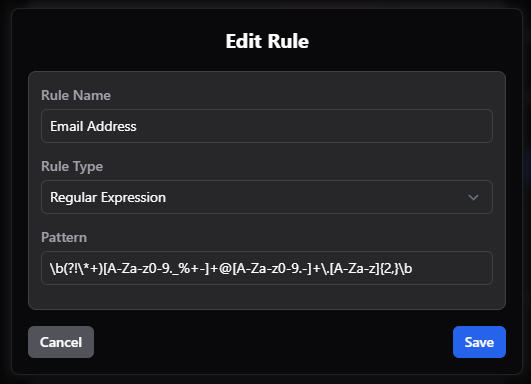
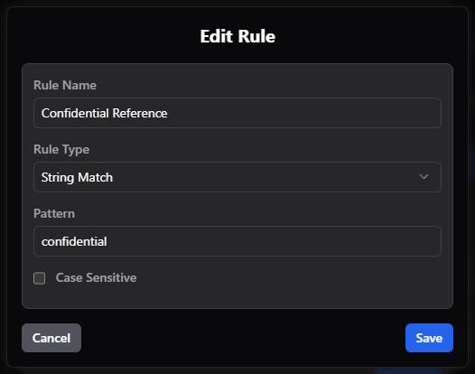
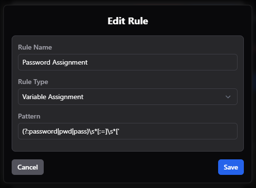

# TypingMind ContentShield

## Table of Contents

- [Features](#features)
- [Screenshots](#screenshots)
- [Using this extension](#using-this-extension)
- [Default Rules](#default-rules)
- [Managing Rules](#managing-rules)
  - [Adding a new rule](#adding-a-new-rule)
  - [Editing a rule](#editing-a-rule)
  - [Deleting rules](#deleting-rules)
  - [Enabling/disabling rules](#enablingdisabling-rules)
- [Customizing Appearance](#customizing-appearance)
- [Importing and Exporting Rules](#importing-and-exporting-rules)
  - [Exporting rules](#exporting-rules)
  - [Importing rules](#importing-rules)
- [How It Works](#how-it-works)
- [Privacy and Security](#privacy-and-security)
- [About me](#about-me)
- [License](#license)

 
💗 <a href="https://buymeacoffee.com/itcon">If you found this useful, please consider buying me a coffee</a> 💗

## Features

- Real-time monitoring of chat input for potentially sensitive information
- Customizable content rules with support for:
  - String Match: Simple text matching with case sensitivity option
  - Regular Expression: Advanced pattern matching
  - Variable Assignment: Specifically detect sensitive data in variable assignments
- Visual highlighting of detected sensitive information with:
  - Modern dispersed glowing border effect
  - Customizable colors and intensity
  - Smooth transitions and animations
- Dynamic rule counter showing total number of active rules
- Detailed warning tooltip showing:
  - Rule that detected the content
  - Detected sensitive text
  - Position of the detected content (line and character)
  - Interactive position markers for quick navigation
- Built-in default rules for common sensitive data types:
  - Credit Card Numbers (with flexible format matching)
  - Email Addresses
  - Social Security Numbers (SSN)
  - Secret Variable Assignments (password, secret, key, token)
  - Confidential References
  - Secret References
- Complete rule management system:
  - Add, edit, delete individual rules
  - Bulk delete all rules with confirmation
  - Enable/disable individual rules
  - Real-time regex validation
  - Rule counter in section headers
- Customizable appearance settings:
  - Highlight color with glow effect
  - Border width options
  - Warning header color
  - Menu button visibility toggle
  - Customizable keyboard shortcut (default: Shift+Alt+P)
  - Menu icon placement options
- Import/export functionality using TSV format for easy rule sharing
- Local storage of configurations with reasonable defaults
- Non-intrusive UI that integrates seamlessly with the TypingMind interface

## Screenshots

  <table>
    <tr>
      <td align="center">
         
        <em>ContentShield detecting sensitive information in real-time with glowing border effect and detailed tooltip</em>
      </td>
      <td align="center">
         
        <em>Configuration panel showing content rules management with dynamic rule counter</em>
      </td>
    </tr>
    <tr>
      <td align="center">
         
        <em>Customizable appearance settings including colors, border effects, and keyboard shortcuts</em>
      </td>
      <td align="center">
         
        <em>Adding a Regular Expression rule with real-time pattern validation</em>
      </td>
    </tr>
    <tr>
      <td align="center">
         
        <em>Simple string matching rule with case sensitivity option</em>
      </td>
      <td align="center">
         
        <em>Variable Assignment rule for detecting sensitive data in code</em>
      </td>
    </tr>
  </table>

## Using this extension

1. Load `https://itcon-pty-au.github.io/typingmind-contentshield/contentshield.js` into Menu > Preferences > Extension in TypingMind.
2. A new "Shield" button will appear in the TypingMind sidebar.
3. Click on the Shield button to access the configuration panel where you can:
   - Enable/disable ContentShield
   - Manage content rules (with rule count display)
   - Customize appearance settings
   - Import/export rule configurations
4. Alternatively, you can use the keyboard shortcut (default: Shift+Alt+P) to open the configuration panel.

## Default Rules

The extension comes with six predefined rules to detect common types of sensitive information:

1. **Credit Card Number** (Regular Expression)

   - Detects sequences of 13-16 digits with optional spaces or dashes
   - Pattern: `\b(?:\d[ -]*?){13,16}\b`

2. **Email Address** (Regular Expression)

   - Detects standard email address formats
   - Pattern: `\b[A-Za-z0-9._%+-]+@[A-Za-z0-9.-]+\.[A-Za-z]{2,}\b`

3. **SSN** (Regular Expression)

   - Detects Social Security Number patterns (xxx-xx-xxxx format)
   - Pattern: `\b(?:\d{3}[-.]?){2}\d{4}\b`
   - Supports optional dots or dashes as separators

4. **Secret Variable** (Variable Assignment)

   - Detects assignments to sensitive variables
   - Pattern: `(password|secret|key|token)\s*=\s*["']([^"']+)["']`
   - Matches variable names containing: password, secret, key, token

5. **Confidential Reference** (String Match)

   - Simple case-insensitive match for "confidential"
   - Non-regex, exact text match

6. **Secret Reference** (String Match)
   - Simple case-insensitive match for "secret"
   - Non-regex, exact text match

## Managing Rules

### Adding a new rule

1. Open the ContentShield configuration panel
2. Click "Add Rule"
3. Provide the following details:
   - Rule Name - A descriptive name for the rule
   - Rule Type - Choose between:
     - "String Match" - Simple text matching with case sensitivity option
     - "Regular Expression" - Advanced pattern matching
     - "Variable Assignment" - Detect sensitive data in variable assignments
   - Pattern - The text pattern to detect
   - Case Sensitive (for String Match only) - Toggle if the match should be case-sensitive

### Editing a rule

1. Click the edit (pencil) icon next to any rule
2. Modify the rule details in the editor
3. Click "Save" to apply changes

### Deleting rules

- Individual rule: Click the delete (trash) icon next to any rule
- All rules: Click "Delete All" button and confirm the action
  - A confirmation dialog will suggest exporting rules as backup
  - The rules counter will update automatically

### Enabling/disabling rules

Toggle the checkbox next to any rule to enable or disable it without deleting it.

## Customizing Appearance

1. Open the ContentShield configuration panel
2. Click "Show" in the Appearance section
3. Adjust:
   - Highlight Color - The color used for the glowing border effect
   - Border Width - Choose from Thin (1px) to Very Thick (4px)
   - Warning Header Color - The background color for the warning header
   - Menu & Keyboard Controls:
     - Hide extension from menu - Option to remove the ContentShield button from the sidebar
     - Keyboard Shortcut - Set a custom keyboard combination to open the panel (required if extension is hidden from menu)
   - Menu Icon Placement - Choose where to position the ContentShield button in the sidebar
4. Click "Save Styles" to apply changes

## Importing and Exporting Rules

### Exporting rules

1. Click the "Export" button in the ContentShield configuration panel
2. A TSV (Tab-Separated Values) file containing your rules will be downloaded
3. The TSV format includes: id, type, pattern, name, active status, description, and case sensitivity

### Importing rules

1. Click the "Import" button in the ContentShield configuration panel
2. Select a TSV file containing rules (<a href="https://github.com/itcon-pty-au/typingmind-contentshield/blob/main/typingmind-contentshield-rules.tsv">Here is a comprehensive rule set for importing </a>)
3. The system will:
   - Validate all rules (especially regex patterns)
   - Skip any invalid rules
   - Add new rules that don't conflict with existing ones
   - Show a summary of added and skipped rules

## How It Works

The extension monitors chat input in real-time, scanning for patterns defined in your active rules. When sensitive information is detected:

1. The chat input field is highlighted with a glowing border effect that:
   - Uses multiple layers of box shadows for depth
   - Includes an inner glow effect
   - Animates smoothly on appearance/disappearance
2. A detailed tooltip appears showing:
   - Which rules were triggered
   - The detected sensitive text
   - The location (line and character position) of each match
3. Clicking on a position indicator will:
   - Focus the input field
   - Select the relevant text
   - Scroll smoothly to bring the text into view

This visual feedback helps you identify sensitive information before sending your messages.

## Privacy and Security

- All processing is done entirely client-side
- No data is sent to any server
- Your configurations are stored only in your browser's local storage
- The extension has no external dependencies

## About me

I am a passionate developer dedicated to creating useful tools that can benefit the community. My goal is to distribute all of my projects as open source, enabling others to learn, contribute, and innovate together. If you appreciate my work and want to support my efforts, feel free to buy me a coffee ❤️!

## License

This project is licensed under the MIT License - see the LICENSE file for details.
